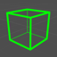
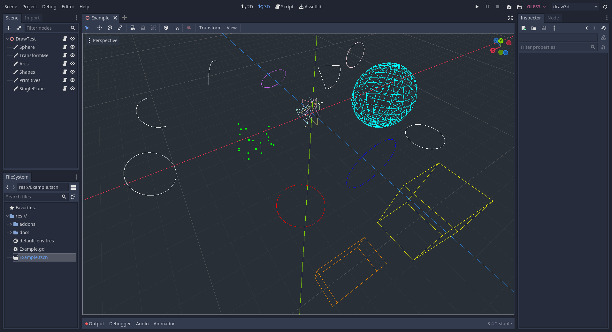

# Draw3D

A small library for drawing simple wireframe shapes in 3D.

***Updated for Godot4***. For the 3.x version see the
[godot3 branch](https://github.com/nyxkn/godot-draw3d/tree/godot3).



This library provides a custom `Draw3D` node that you can add to your scenes,
with which you can draw simple geometry like lines, arcs, circles, and cubes.

You can use this to easily add simple shapes to your objects.
Mainly used for debugging, or visualizing prototypes.

Usage is similar to the [custom drawing in 2D](https://docs.godotengine.org/en/stable/tutorials/2d/custom_drawing_in_2d.html)
that is already present in Godot, and for consistency I tried to keep
the parameters in the same order as the 2D draw calls whenever possible.
   
Have a look at the [documentation](docs/addons/draw3d/Draw3D.md)
to see all the available methods and how to call them.

<a href="media/screenshot-1.png?raw=true"></a>

## Installation

Simply grab `Draw3D.gd` and place it somewhere in your project.

This script provides a custom node called `Draw3D`, which you can then add to your scene
from the `Add Child Node` menu in the editor.

Alternatively you can also add it from code like this:

``` gdscript
var draw = Draw3D.new()
add_child(draw)

draw.cube()
```

## Usage

Add the Draw3D node to your scene and then call any of the draw or shape functions.
You can find the Draw3D node in the `Create New Node` dialog.

There are two ways of using this library:

1. You can add a new Draw3D instance to every object you want to draw from.
2. Or you can use a single instance of Draw3D as a canvas on which to draw many different shapes.

Or of course a mix of either.

### Basic usage: new Draw3D instance per node

With this method, you add a new Draw3D instance as a child of your object,
and then you call a draw function from your script.

Take note that the Draw3D node extends [MeshInstance3D](https://docs.godotengine.org/en/stable/classes/class_meshinstance3d.html),
so you get to use all of its features.
Most notably the transform it inherits from the Node3D node.

So you can draw a basic shape with no position offset, no orientation, and no scale,
and use the MeshInstance3D's transform properties instead to adjust all of those things.

``` gdscript
# assuming you've previously added a $Draw3D node as a child

func _ready():
    # draws a basic circle of radius 1 at origin, lying on the XZ plane
    $Draw3D.circle_XZ()
    
func _process(delta):
    # manipulate the transform of the Draw3D node
    $Draw3D.rotate_x(delta)
```

### Using Draw3D as a canvas

When using Draw3D as a canvas, you can draw multiple shapes on it
just like on a regular 2D CanvasItem.

In this case you cannot change the transform of each shape individually,
so you must specify the position and scale/orientation parameters.

``` gdscript
func _ready():
    var draw = $Draw3D
    draw.circle(Vector3(4, 0, 0), Basis.IDENTITY.rotated(Vector3.UP, TAU/3))
    draw.cube(Vector3(1, 2, 3), Basis.IDENTITY.scaled(Vector3(1, 2, 3)))
```

#### Basis

The generic shape drawing calls `circle()`, `arc()`, and `cube()` take a Basis argument.
Basis in Godot is a transform that defines both rotation and scale, without origin.

This is the most flexible way of defining orientation and scale.
There are many ways of constructing a Basis.
See the [Godot documentation](https://docs.godotengine.org/en/stable/classes/class_basis.html) for more information.

### Caveat: drawing inside _process()

If you're calling the draw functions in _process(), make sure to call clear() as well,
otherwise the draw function will keep adding a new set of vertices on every cycle
without removing the old ones.

``` gdscript
func _process(delta):
    var time = OS.get_ticks_msec() * 0.001
    $Draw3D.clear()
    $Draw3D.circle(Vector3.ZERO, Basis(Vector3(time, 0, 0)))
```

### List of drawing functions

There are a few basic functions to draw primitives such as points and lines:

- draw_points
- draw_line
- draw_line_loop

Then there are a few generic draw calls for basic shapes:

- circle
- arc
- cube

These all take a Basis parameter to define orientation and scale. See [above](#using-draw3d-as-a-canvas).

<!-- See the [docs](docs/addons/draw3d/Draw3D.md) for more details on how to use all the functions. -->

#### Shortcut functions

Some shortcut functions are then provided for quickly drawing shapes with predefined orientation,
or for defining rotation from a normal.

With predefined orientation:

- circle_XZ
- circle_XY
- arc_XY
- cube_up

And from a normal:

- circle_normal
- arc_normal
- cube_normal

## Example

You can check out the provided Example scene to see a few working examples.

Or have a quick look at [draw_3d_example.gd](draw_3d_example.gd)
to see an example usage of some of the shape functions.

## Documentation

You can find the generated documentation from within the Help dialog in Godot.
Just search for Draw3D.

## Donations

If you find this project helpful and you feel like it, throw me some coins!

And drop a [star](stargazers) on this repo :)

[](https://www.buymeacoffee.com/nyxkn)

[](https://liberapay.com/nyxkn)

[](https://ko-fi.com/nyxkn)

[](https://paypal.me/nicolasiagri)

Bitcoin: bc1qfu5gk78898zdcxw372unmwua0yd5luf3z60sgq

## Credits

Inspired by [this short script](https://github.com/Zireael07/FreeRoamRoguelikeRacerPrototype/blob/master/game/scripts/draw_line.gd) by [Zireael07](https://github.com/Zireael07).

A few similar projects:

- [godot_debug_draw](https://github.com/Zylann/godot_debug_draw)
- [godot_debug_draw_cs](https://github.com/DmitriySalnikov/godot_debug_draw_cs)

## License

This project is licensed under the terms of the [MIT license](https://spdx.org/licenses/MIT.html).

